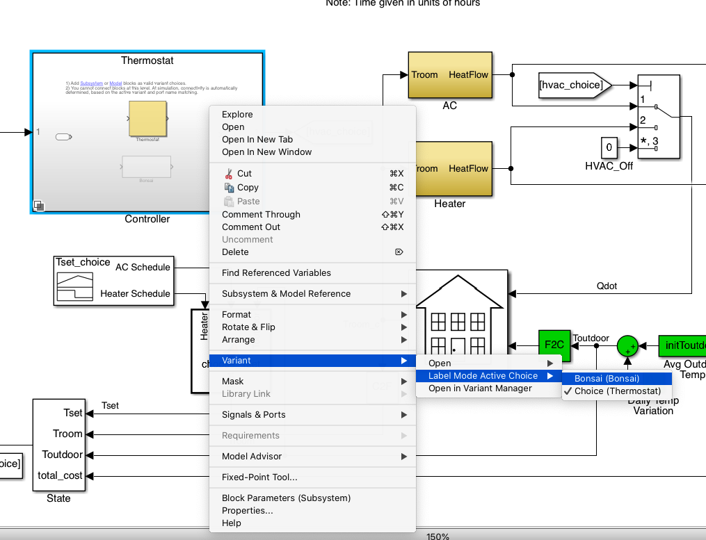
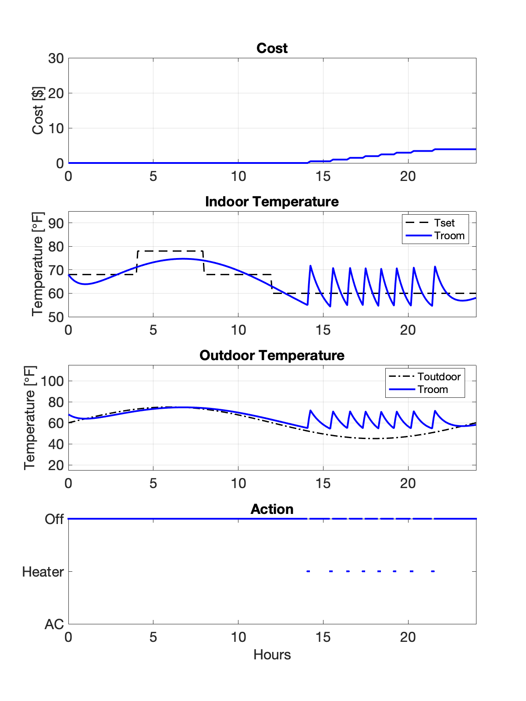
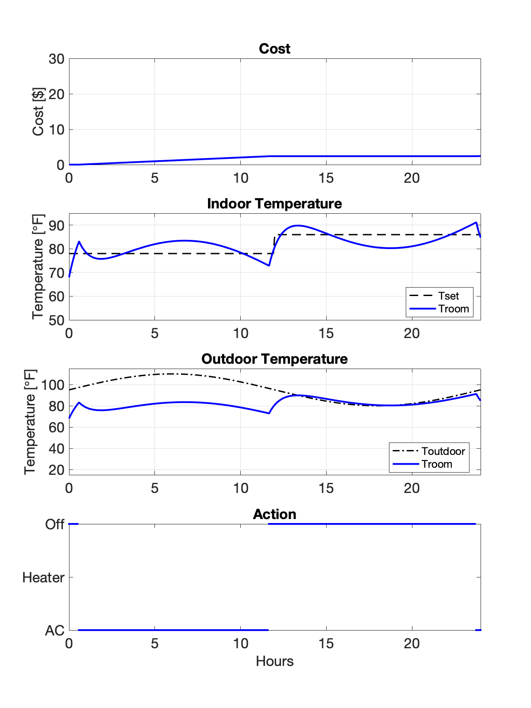
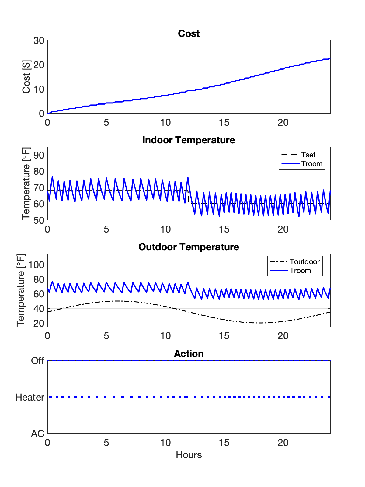
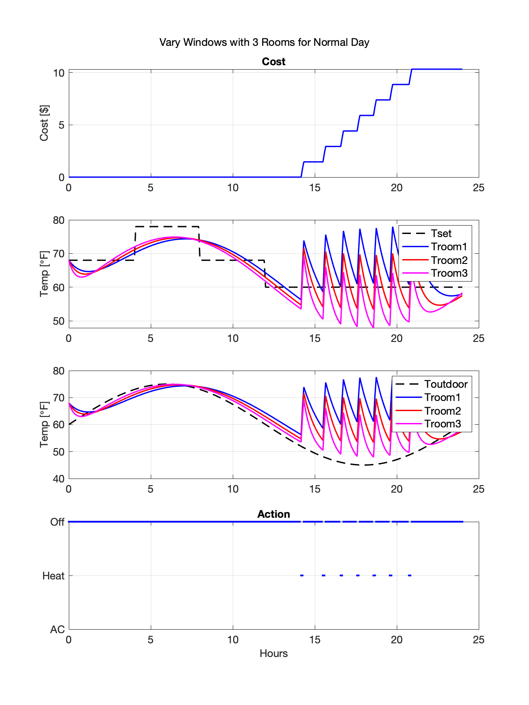
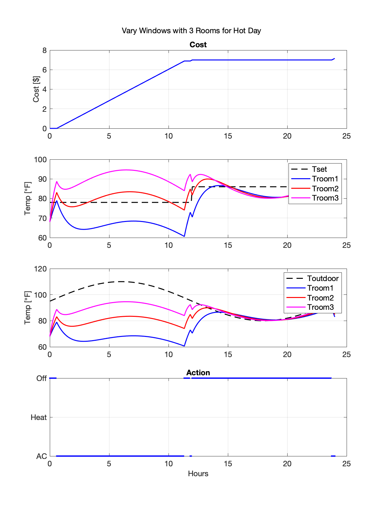
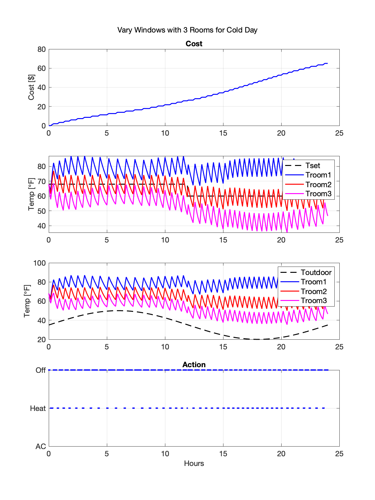

# building-energy-management

## Objective

Train a brain to replace the thermostat controller for the heating and cooling a thermal model of a house with varying outdoor temperatures over the course of two days. The objective is to minimize the dollar cost, but also provide comfort by tracking the set point temperature. Heating is four times as expensive as cooling, which reflects how typically energy bills are more expensive in Winter. Given the temperature swings throughout the day, the AC can struggle with meeting the set point temperature due to the nature of the thermostat controller.

## Action

| Action | Discrete Value | Units |
|----------------------------|-------------------------------|-------------------------------|
| off | 3 | [-] |
| heater_blower | 2 | [-] |
| ac_blower | 1 | [-] |
...

## State

| State | Units |
|----------------------------|-------------------------------|
| Tset | [F] |
| Troom | [F] |
| Toutdoor | [F] |
| cost | [$] |
...

## Constraints

- Can only use AC or heater one at a time
- Tset is based on [energy.gov](https://www.energy.gov/energysaver/thermostats) recommended thermostat settings:
  - Summer: 78F during the day, 86F at night
  - Winter: 68F during the day, 60 at night
  - If Toutdoor > 73, follow the summer Tset, else follow the winter Tset.
- Troom within < 5 degrees F of set point

## Configuration Parameters

- length of house [m]
- width of house [m]
- height of house [m]
- number of windows [-]
- conduction coefficient of wall insulation [J/hr/m/C]
- thickness of wall insulation [m]
- Tset [F]
- Toutdoor [F]

## Switching between Benchmark and Bonsai Block

The controller block in buildingEnergyManagement.slx allows you to use the same file for both the benchmark thermostat and the bonsai brain. Simply double click on the block to choose between the benchmark thermostat and the Bonsai block.

## Tutorial 1

### Benchmark, 1 room
Configuration:
- Toutdoor = 60F
- number of rooms = 1
- number of windows = 6

Results:
- Mean Absolute Error = 3.4517F
- Cost = $3.92

### Benchmark, hot day
Configuration:
- Toutdoor = 95F
- number of rooms = 1
- number of windows = 6

Results:
- Mean Absolute Error = 3.0913F
- Cost = $2.42

### Benchmark, cold day
Configuration:
- Toutdoor = 35F
- number of rooms = 1
- number of windows = 6

Results:
- Mean Absolute Error = 3.5867F
- Cost = $22.71

## Tutorial 2

### Benchmark, 3 rooms
Configuration:
- Toutdoor = 60F
- number of rooms = 3
- number of windows = 3, 6, 12

Results:
- Mean Absolute Error = [5.6379, 5.6288, 5.6219]F
- Cost = $10.32

### Benchmark, hot day
Configuration:
- Toutdoor = 95F
- number of rooms = 3
- number of windows = 3, 6, 12

Results:
- Mean Absolute Error = [6.8203, 3.9992, 5.487]F
- Cost = $7.16

### Benchmark, cold day
Configuration:
- Toutdoor = 35F
- number of rooms = 3
- number of windows = 3, 6, 12

Results:
- Mean Absolute Error = [13.9906, 3.99677, 12.4286]F
- Cost = $65.00

## Acknowledgements

[Mathworks Example](https://www.mathworks.com/help/simulink/slref/thermal-model-of-a-house.html)