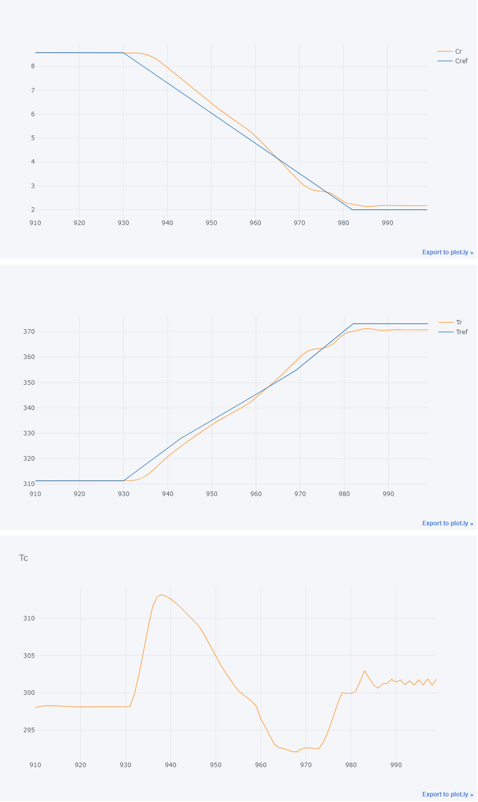

# Chemical Process Optimization

The simulink model used for this project simulates an Continuous Stirred Tank Reactor (CSTR). CSTR consists of an exothermic reaction that is controlled setting the temperature of the coolant (separate from the container where the reaction is happening):

*More information can be found [HERE](https://www.mathworks.com/help/control/ug/gain-scheduled-control-of-a-chemical-reactor.html)

## Objective

Replace the existing benchmark control with a single bonsai brain that would modify the Residual Concentration `Cr`, without thermal runaway. The process dynamics are complex because nonlinearities and instablities exist when manipulating the coolant Temperature, `Tc`. 

The given benchmark for this model uses 2 controls in order to linearly transition from one step to the next.

The 2 controllers used are (1) a PI and (2) a lead compensator. Additionally, as shown bellow, the gains required for the control are non-linear as well:

More detailed, here are the gains required for the controls presented above:

## Actions

Bare minimum for the sim:

| Action | Continuous Value | Units |
|----------------------------|-------------------------------|-------------------------------|
| dTc | [-20, 20] | [Kelvin] |

Final set for **bonsai training**:

- Performance improved when making the brain learn the per-timestep adjustment to apply to previous dTc.
- Thus, we mantained control to be dTc_adjustment, and added an accumulator on sim side.

| Action | Continuous Value | Units |
|----------------------------|-------------------------------|-------------------------------|
| dTc_adjust | [-5, 5]* | [Kelvin/min] |

*Note, given an additional rule that requires keeping dTc changes at no more than 10 Kelvins/min, we forced dTc_adjustment to be on the [-5, 5] range (for Ts=0.5min)

## States

Bare minimum for the sim:

| State | Continuous Value | Units |
|----------------------------|-------------------------------|-------------------------------|
| Cr | [1, 10] | [kmol/m3] |
| Tr | [250, 400] | [Kelvin] |
| Tc | [250, 400] | [Kelvin] |
| Cref | [1, 10] | [kmol/m3] |

Final set of Observable States for **bonsai training**:

| State | Continuous Value | Units | Notes |
|----------------------------|-------------------------------|-------------------------------|-------------------------------|
| Cr | [1, 10] | [kmol/m3] |
| Tr | [250, 400] | [Kelvin] |
| Tc | [250, 400] | [Kelvin] |
| Cref | [1, 10] | [kmol/m3] |

*Tref was removed as observable state since brain to simplify brain's training. With Bonsai's solution we don't need Tref to be able to drive the concentration linearly from one point to the next.

## Constraints

- Tc < 10 degrees / min

## Sim Configuration Parameters

- target concentration: Final desired concentration
- Cf: Concentration fed to the CSTR
- Tf: Temperature fed to the CSTR
- TcEQ(1): Initial absolute coolant temperature
- Cref: Scheduled concentration for reaction
- Tref: Scheduled temperature for reaction (look-up table used to extract corresponding linear desired transition)

## Bonsai Configuration Parameters

- Cref_signal: An integer in [1, 4] range (both included). Indicates the concentration transition to perform:
    - 1 >> 8.57 to 2.00 kmol/m3 over [0, 10, 36, 45] in minutes
    - 2 >> 8.57 to 2.00 kmol/m3 over [0, 2, 28, 45] in minutes
    - 3 >> 8.57 to 2.00 kmol/m3 over [0, 10, 20, 45] in minutes
    - 4 >> 8.57 to 1.00 kmol/m3 over [0, 10, 36, 45] in minutes
- noise_percentage: An integer from 0 to 100 that indicates the amount of gaussian noise to include in both conentration and temperature readouts (Cr & Tr)

## Tested Scenarios

Currently we operate under one configuration only, the shceduled values are fixed as follows:

| State | Initial Value (t=x) | Final Value (t=x+13mins) | Units |
|----------------------------|-------------------------------|-------------------------------|-------------------------------|
| Cf | 10 | 10 | [kmol/m3] |
| Tf | 298.2 | 298.2 | [Kelvin] |
| TcEQ(1) | 298.0 | 298.0 | [Kelvin] |
| Cref | 8.57 | 2 | [kmol/m3] |
| Tref | 311.3 | 373.1 | [Kelvin] |
| dTc | 0 | 7 | [Kelvin] |

## Switching between Benchmark and Bonsai Block

The controller block in ChemicalProcessOptimization.slx allows you to use the same file for both the benchmark controller and the bonsai brain. Simply right click on the block, then choose Variant-> Label Mode Active Choice -> Bonsai.

## Constant Gain Controller (No Table Lookup)

Constant gains demonstrate the instabilities and how complex it is to transition from 8.57 kmol/3 to 2 kmol/m3

## Benchmark

- 0.5641 kmol/m3 rms error
- 4.6046 degrees K rms error

Note, **"run_benchmark.m" contains the information required to retrieve the benchmark results.**

## Bonsai Brain

Performance averaged over 4 trained brains:
- 0.4065 kmol/m3 rms error
- 3.7276 kmol/m3 rms error

Performance for most stable brain (out of 4):
- 0.2960 kmol/m3 rms error
- 2.7143 kmol/m3 rms error

## Benchmark Stretched

The gains were designed with a specific region in mind and here we changed the range from [8.57, 2] to [8.57, 1] kmol/m3. 

## Acknowledgements

[Simulink Example](https://www.mathworks.com/help/control/ug/gain-scheduled-control-of-a-chemical-reactor.html;jsessionid=46145216a86340e49ff92683290f#d122e64826)

> Seborg, D.E. et al., "Process Dynamics and Control", 2nd Ed., 2004, Wiley, pp. 34-36.ss