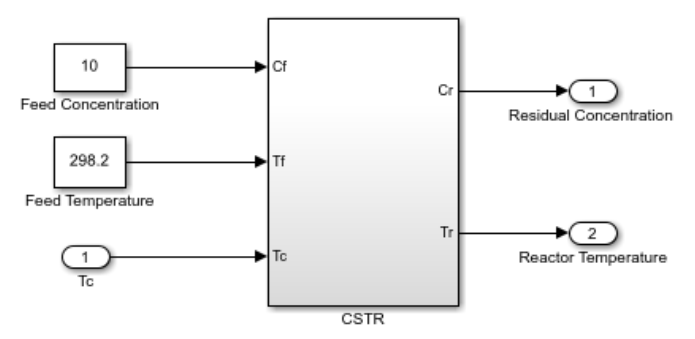
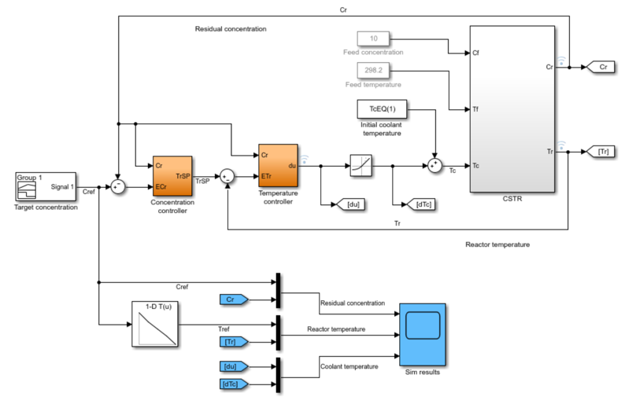
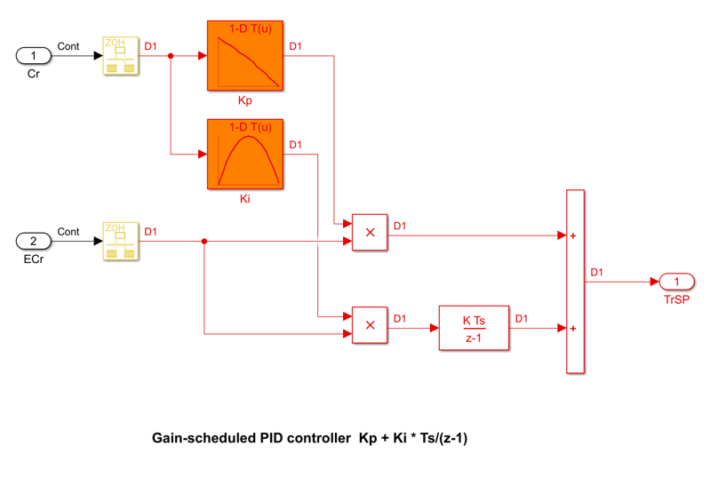
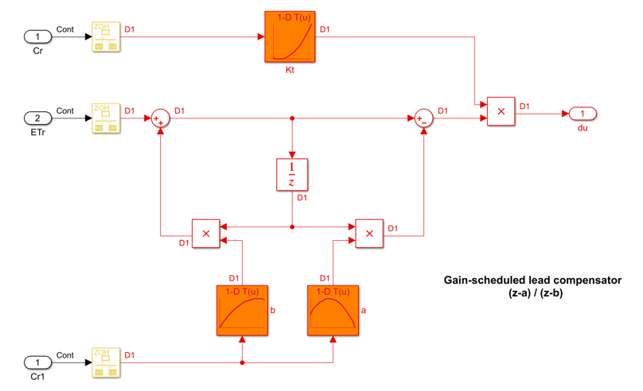
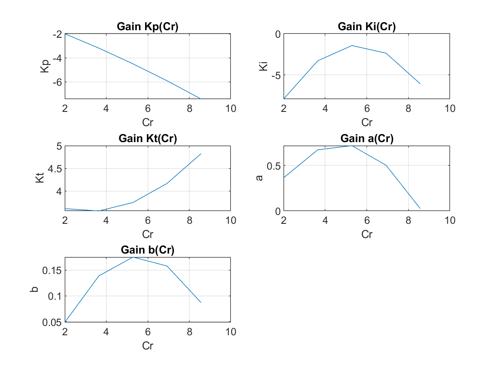
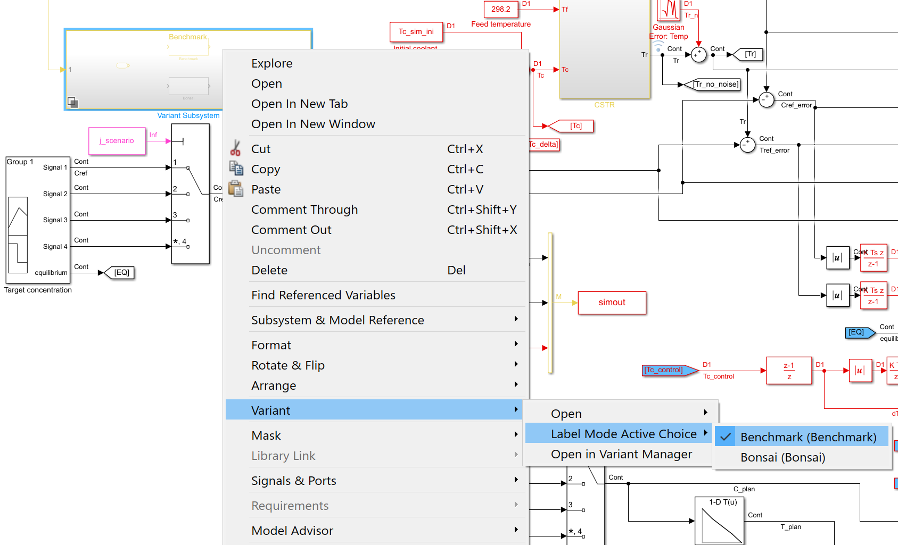
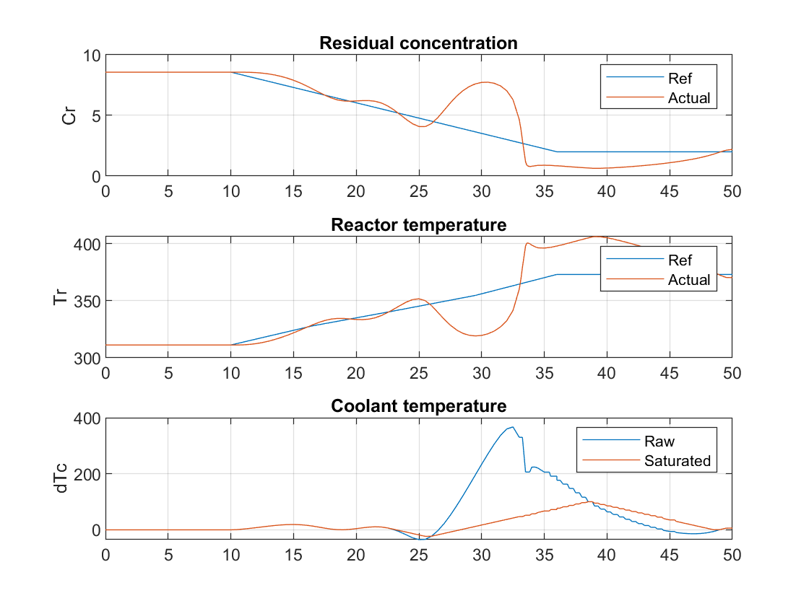
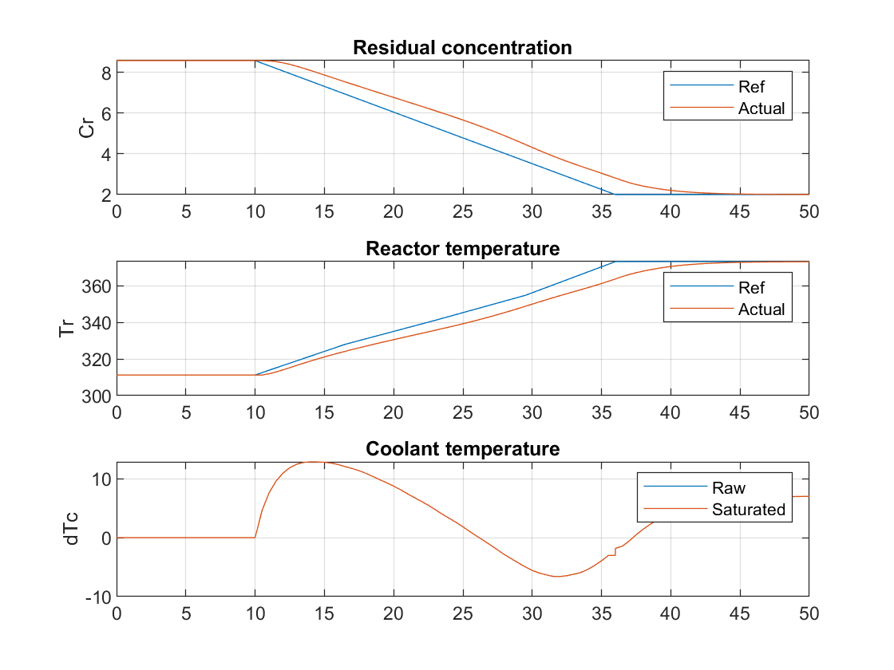

# Chemical Process Optimization

The simulink model used for this project simulates an Continuous Stirred Tank Reactor (CSTR). CSTR consists of an exothermic reaction that is controlled setting the temperature of the coolant (separate from the container where the reaction is happening):

*More information can be found [HERE](https://www.mathworks.com/help/control/ug/gain-scheduled-control-of-a-chemical-reactor.html)

## Objective

Replace the existing benchmark control with a single bonsai brain that would modify the Residual Concentration `Cr`, without thermal runaway. The process dynamics are complex because nonlinearities and instablities exist when manipulating the coolant Temperature, `Tc`. 

The given benchmark for this model uses 2 controls in order to linearly transition from one step to the next.

The 2 controllers used are (1) a PI and (2) a lead compensator. Additionally, as shown bellow, the gains required for the control are non-linear as well:

More detailed, here are the gains required for the controls presented above:

## Actions

Bare minimum for the sim:

| Action | Continuous Value | Units |
|----------------------------|-------------------------------|-------------------------------|
| dTc | [-20, 20] | [Kelvin] |

Final set for **bonsai training**:

| Action | Continuous Value | Units |
|----------------------------|-------------------------------|-------------------------------|
| dTc | [-10, 10] | [Kelvin/min] |

*Note, given an additional rule that requires keeping dTc changes at no more than 10 Kelvins/min, we decided to incorporate an accumulator on the sim side, and force actions to be on the [-5, 5] range (for Ts=0.5min)

## States

[TODO] Review

Bare minimum for the sim:

| State | Continuous Value | Units |
|----------------------------|-------------------------------|-------------------------------|
| Cr | [1, 10] | [kmol/m3] |
| Tr | [250, 400] | [Kelvin] |
| Tc | [250, 400] | [Kelvin] |
| Cref | [1, 10] | [kmol/m3] |
| Tref | [250, 400] | [Kelvin] |

Final set for **bonsai training**:

| State | Continuous Value | Units | Notes |
|----------------------------|-------------------------------|-------------------------------|-------------------------------|
| Cr | [1, 10] | [kmol/m3] | reactor concentration |
| Tr | [250, 400] | [Kelvin] | reactor temperature |
| Cref_delta | [1, 10] | [kmol/m3] | difference between scheduled concentration and reactor's real time read |
| Tref_delta | [250, 400] | [Kelvin] | difference between scheduled temperature and reactor's real time read |
| Tc | [250, 400] | [Kelvin] | coolant temperature |
| Tc_d | [-10, 10] | [Kelvin/min] | discrete derivative of coolant temperature |
| Tc_d_d | [-10, 10] | [Kelvin/min] | 2nd discrete derivative of coolant temperature |

## Constraints

- Tc < 10 degrees / min

## Configuration Parameters

[TODO] - Review

- target concentration: Final desired concentration
- Cf: Concentration fed to the CSTR
- Tf: Temperature fed to the CSTR
- Tc_ini: Initial absolute coolant temperature
- Cref: Scheduled concentration for reaction
- Tref: Scheduled temperature for reaction (look-up table used to extract corresponding linear desired transition)

## Tested Scenarios

[TODO] - Review

Currently we operate under one configuration only, the shceduled values are fixed as follows:

| State | Initial Value (t=x) | Final Value (t=x+13mins) | Units |
|----------------------------|-------------------------------|-------------------------------|-------------------------------|
| Cf | 10 | 10 | [kmol/m3] |
| Tf | 298.2 | 298.2 | [Kelvin] |
| Tc_ini | 298.0 | 298.0 | [Kelvin] |
| Cref | 8.57 | 2 | [kmol/m3] |
| Tref | 311.3 | 373.1 | [Kelvin] |
| dTc | 0 | 7 | [Kelvin] |

## Switching between Benchmark and Bonsai Block

The controller block in ChemicalProcessOptimization.slx allows you to use the same file for both the benchmark controller and the bonsai brain. Simply right click on the block, then choose Variant-> Label Mode Active Choice -> Bonsai.

## Constant Gain Controller (No Table Lookup)

Constant gains demonstrate the instabilities and how complex it is to transition from 8.57 kmol/3 to 2 kmol/m3

## Benchmark

- 0.5641 kmol/m3 rms error
- 4.6046 degrees K rms error

Note, **"run_benchmark.m" contains the information required to retrieve the benchmark results.**

## Bonsai Brain

- 0.3973 kmol/m3 mean error (per iteration)*

** different set schedule

**Inkling file required to train the bonsai brain and retrieve provided results is provided as "machine_teacher.ink".**

Note, during assessment the brain would only retrieve 44 iterations (instead of the desired 90). The next version will have this issue fixed. For now, this is the corresponding comparison table of 'error to reference' between benchmark and bonsai brain:

## Brain Performance Evaluation

To evaluate performance a Python script is provided under "sim_evaluation" folder.

1. Remove simulator selection on INK file ("package")
2. Run train_bonsai.m
3. Run brain assessment, connecting to unmanaged sim
4. Wait until >20 episodes take place
5. Stop matlab execution & brain
6. Transfer created ".csv" file on your sim folder to "sim_evaluation" folder
7. Modify Python script to point to recently created ".csv" (specified at the very beginning)
8. Run Python script and retrieve transition VS equilibrium performance

* Note, currently transition is considered from t=2 to t=30 (not t=28, which suits the 'equilibrium' state)

## Benchmark Stretched

The gains were designed with a specific region in mind and here we changed the range from [8.57, 2] to [8.57, 1] kmol/m3. 

## Acknowledgements

[Simulink Example](https://www.mathworks.com/help/control/ug/gain-scheduled-control-of-a-chemical-reactor.html;jsessionid=46145216a86340e49ff92683290f#d122e64826)

> Seborg, D.E. et al., "Process Dynamics and Control", 2nd Ed., 2004, Wiley, pp. 34-36.ss