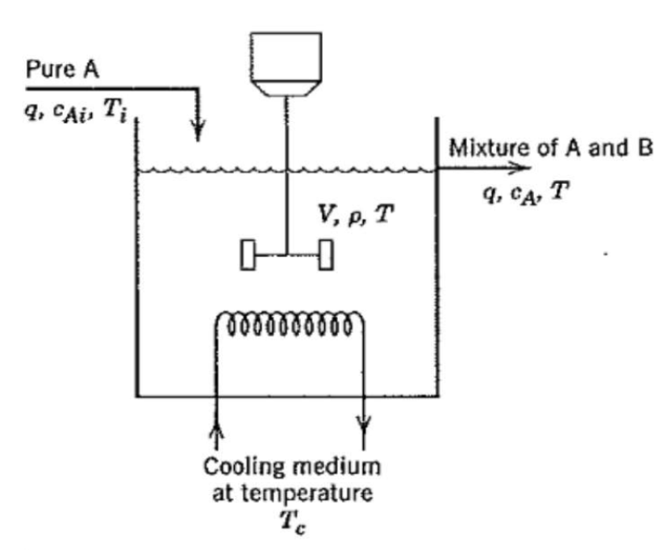

# Chemical Process Optimization

The process considered here is a Continuous Stirred Tank Reactor (CSTR) during transition from low to high conversion rate (high to low residual concentration). Because the chemical reaction is exothermic (produces heat), the reactor temperature must be controlled to prevent a thermal runaway. The control task is complicated by the fact that the process dynamics are nonlinear and transition from stable to unstable and back to stable as the conversion rate increases. The reactor dynamics are modeled in Simulink. The controlled variables (states) are the residual concentration  and the reactor temperature , and the manipulated variable (action) is the temperature  of the coolant circulating in the reactor's cooling jacket.

This example shows how to use Project Bonsai’s Machine Teaching strategies to learn a controller for a chemical reactor transitioning from low to high conversion rate. For background, see Seborg, D.E. et al., "Process Dynamics and Control", 2nd Ed., 2004, Wiley, pp. 34-36. This sample is largely adapted from the MathWorks’ [Gain scheduled control of a chemical reactor](https://www.mathworks.com/help/control/ug/gain-scheduled-control-of-a-chemical-reactor.html).

## Objective

Replace the existing benchmark control with a single bonsai brain that would modify the Residual Concentration `Cr`, without thermal runaway. The process dynamics are complex because nonlinearities and instablities exist when manipulating the coolant Temperature, `Tc`. 

The given benchmark for this model uses 2 controls in order to linearly transition from one step to the next.

The 2 controllers used are (1) a PI and (2) a lead compensator. Additionally, as shown bellow, the gains required for the control are non-linear as well:

More detailed, here are the gains required for the controls presented above:

## Actions

Bare minimum for the sim:

| Action | Continuous Value | Units |
|----------------------------|-------------------------------|-------------------------------|
| dTc | [-20, 20] | [Kelvin] |

Final set for **bonsai training**:

- Performance improved when making the brain learn the per-timestep adjustment to apply to previous dTc.
- Thus, we mantained control to be dTc_adjustment, and added an accumulator on sim side.

| Action | Continuous Value | Units |
|----------------------------|-------------------------------|-------------------------------|
| dTc_adjust | [-5, 5]* | [Kelvin/min] |

*Note, given an additional rule that requires keeping dTc changes at no more than 10 Kelvins/min, we forced dTc_adjustment to be on the [-5, 5] range (for Ts=0.5min)

## States

Which matches the set of Observable States used for **bonsai training**

| State | Continuous Value | Units |
|----------------------------|-------------------------------|-------------------------------|
| Cr | [1, 10] | [kmol/m3] |
| Tr | [250, 400] | [Kelvin] |
| Tc | [250, 400] | [Kelvin] |
| Cref | [1, 10] | [kmol/m3] |

- Note, .ink file defines ranges higher than the ones shown here. That is made in purpose since the brain will try to explore, and thus will hit extreme limits in doing so.

*Tref was removed as observable state since brain to simplify brain's training. With Bonsai's solution we don't need Tref to be able to drive the concentration linearly from one point to the next.

## Constraints

- Tc < 10 degrees / min

## Sim Configuration Parameters

- target concentration: Final desired concentration
- Cf: Concentration fed to the CSTR
- Tf: Temperature fed to the CSTR
- TcEQ(1): Initial absolute coolant temperature
- Cref: Scheduled concentration for reaction
  - From starting equilibrium point, linearly moving towards scheduled target
- Tref: Scheduled temperature for reaction (look-up table used to extract corresponding linear desired transition)

## Bonsai Configuration Parameters

- Cref_signal: An integer in [1, 4] range (both included). Indicates the concentration transition to perform:
    - 1 >> 8.57 to 2.00 kmol/m3 over [0, 10, 36, 45] in minutes
    - 2 >> 8.57 to 2.00 kmol/m3 over [0, 2, 28, 45] in minutes
    - 3 >> 8.57 to 2.00 kmol/m3 over [0, 10, 20, 45] in minutes
    - 4 >> 8.57 to 1.00 kmol/m3 over [0, 10, 36, 45] in minutes
- noise_percentage: An integer from 0 to 100 that indicates the amount of gaussian noise to include in both conentration and temperature readouts (Cr & Tr)

## Tested Scenarios

Currently we operate under one configuration only, the shceduled values are fixed as follows:

| State | Initial Value (t=x) | Final Value (t=x+13mins) | Units |
|----------------------------|-------------------------------|-------------------------------|-------------------------------|
| Cf | 10 | 10 | [kmol/m3] |
| Tf | 298.2 | 298.2 | [Kelvin] |
| TcEQ(1) | 298.0 | 298.0 | [Kelvin] |
| Cref | 8.57 | 2 | [kmol/m3] |
| Tref | 311.3 | 373.1 | [Kelvin] |
| dTc | 0 | 7 | [Kelvin] |

## Switching between Benchmark and Bonsai Block

The controller block in ChemicalProcessOptimization.slx allows you to use the same file for both the benchmark controller and the bonsai brain. Simply right click on the block, then choose Variant-> Label Mode Active Choice -> Bonsai.

## Constant Gain Controller (No Table Lookup)

Constant gains demonstrate the instabilities and how complex it is to transition from 8.57 kmol/3 to 2 kmol/m3

## Benchmark - Tutorial 1

- 0.5641 kmol/m3 rms error
- 4.6046 degrees K rms error

Note, **"run_benchmark.m" can be run to retrieve the benchmark results.**

## Benchmark Stretched - Tutorial 2

For the same scenario used for benchmark, we introduce gaussian noise to the concentration and temperature read-outs (Cr and Tr, respectively). We evaluate how well does the model respond to perturbances (noise).

- 2.9722 kmol/m3 rms error
- 30.7213 degrees K rms error

* Note, to not accumulate error due to signal noise when evaluating performance, we campared references (Cref and Tref) against the "no_noise" versions of Cr and Tr. This results in a more accurate measure of RMS error.

## Acknowledgements

[Simulink Example](https://www.mathworks.com/help/control/ug/gain-scheduled-control-of-a-chemical-reactor.html;jsessionid=46145216a86340e49ff92683290f#d122e64826)

> Seborg, D.E. et al., "Process Dynamics and Control", 2nd Ed., 2004, Wiley, pp. 34-36.ss