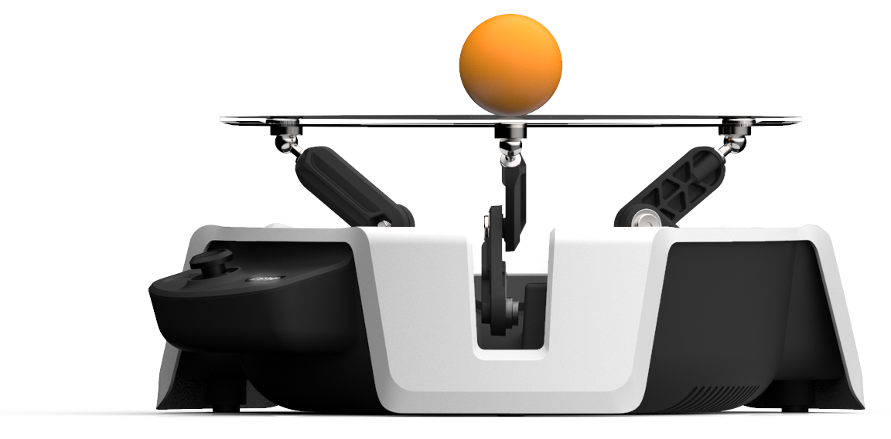
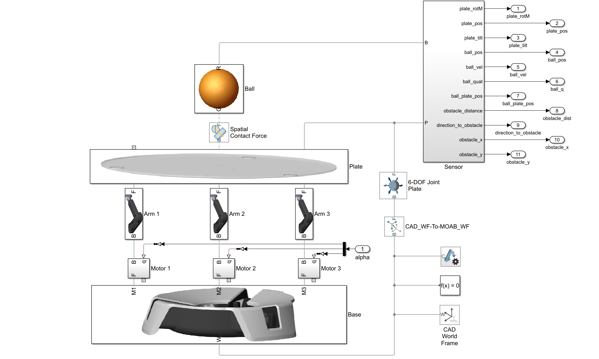

# Moab Overview

<table>
<tr>
<td>
Project Moab is a small balancing robot useful for demonstrating machine teaching on a physical device for Engineers. Project Moab is based on a basic problem: keep a ball balanced on top of a plate held by three arms. But rather than using differential equations and other traditional ways of solving the problem, an engineer will instead teach the AI system how to balance it. Users can very quickly take it into areas where doing it in traditional ways would not be easy, such as balancing an egg instead of a ball.

The Moab M2 robot is an optional companion for Project Bonsai. The Bonsai Azure service contains a complete simulation of Moab, allowing one to experience machine teaching in software. The trained brain can then be downloaded to the bot, allowing direct control.

To learn more about Project Moab, including all of the schematics, check out http://aka.ms/moab. 
</td>
<td>

</td>
</tr>
</table>

# Model Overview
Moab is a dynamic ball-on-plate system is modeled using Simulink and Simscape Multibody. The model contains blocks that represent the multi-body system using imported 3d-CAD parts, joints, contact forces, constraints and sensors. Simscape Multibody formulates and solves the equations of motion for the complete system. During simulation, the system’s states are extracted and sent to a Reinforcement Learning controller (the Bonsai block) which provides the necessary actuation signals to control the plate tilt angles, thus balancing the ball on the plate.

To run the model the following products are required:
1.	Simulink Version 10.0 (R2019b) or greater
2.	Simscape Multibody (R2019b) or greater
3.	Bonsai Toolbox 0.1.0
4.  Bonsai <a href="https://docs.microsoft.com/en-us/bonsai/quickstart/setup">account</a>

Use the MOAB.mlx live script file to get started with the model.